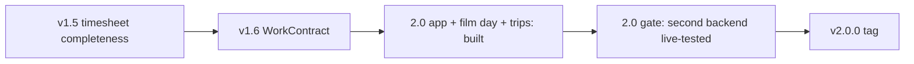

# Plasmai roadmap

Where Plasmai is going. [DESIGN.md](DESIGN.md) is *how* Plasmai should look and behave; this file is *what* is worth building next. [CHANGELOG.md](CHANGELOG.md) stays the history of what already shipped.

Last release: **1.6.2** (tagged). 1.6.3 and the 1.x Kimai 2.67 fixes landed on `main` untagged and are part of 2.0.0.

In progress: **2.0.0** — the version is set everywhere (`metadata.json`, app, store, landing page), but **not tagged**. The tag waits for the 2.0 gate below.

---

## What 2.0 means

1.5.0 closed the “Kemai-like timesheet in the panel” gap for Kimai: live timer, recents, favorites, continue, switch-while-running, edit running *and* stopped entries, tags, billable, create entities, stats, sparkline, work-contract remaining (with vacation/holidays), idle keep/discard/continue, forgot-to-start, multi-profile, KWallet.

**2.0 is not more Display checkboxes.** It means:

1. **A second backend that is no longer experimental** — Clockify, Toggl Track or SolidTime verified with a live account, same UI, capabilities still gating missing APIs. **This is the release gate.**
2. **The same Plasmai on the phone** — the Kirigami app for Android and Plasma Mobile (built, see below).
3. **Provider gaps that 1.5 left explicit** — Clockify name-based tags, SolidTime tags, Toggl `#`/`@` in the description field only if they stay optional beside pickers.

**The 2.0.0 tag is set only when Kimai remains the reference backend and at least one other backend is documented as production-tested** (README, DESIGN.md, landing page no longer call it experimental). Everything else in 2.0.0 is done or optional.

Stay inside DESIGN.md: on the desktop a panel widget, QML-only Store package, features gated with `TimeTracker.providerCapabilities`.

---

## Built for 2.0.0 (untagged)

### Android / Plasma Mobile app (`app/`)

- Kirigami app sharing the provider layer (`contents/code/*`) and copies of the Plasmoid components (`app/qml/shared/`).
- Timer, continue, switch, edit running, add entry, favorites, recents with edit/split/delete, statistics, settings, 11 languages.
- Tested on a Pixel 6 (Android) and offscreen with the KDE style (Plasma Mobile); no real Plasma Mobile device yet.
- Desktop builds (Linux tarball, Flatpak manifest) exist for packaging; on the desktop the Plasmoid stays the product.

### Film day view with the Drehzettel plugin (Plasmoid and app)

- `filmDaySync.js`: plugin probe per profile, engagement gating, only changed fields sent. Online only: no copy on the device, no queue.
- All plugin fields: `breakMinutes`, `catering`, `category`, `note`, `dayType`, `productionDay` (1–7), `shootingDayNumber`, `extraPayCents`; earnings from the day summary.
- Merge of several entries per day. The local mode, offline queue, migration and conflict review of the first 2.0 builds were removed again (online only).

### Trips with the Anfahrten plugin (MileageBundle, Plasmoid and app)

- Log, edit, delete trips linked to a timesheet; Dawarich suggestions; km in statistics; `showTrips` setting.
- App: Trips page, “Commute today”, trip offer after a travel day.

### Removed

- Color distinction and the Maintenance settings page (a separate Kimai plugin handles it).

---

## Shipped in 1.5 / 1.6

### Timesheet completeness (1.5.0)

- Tags on Add entry and Edit running (`TagPicker`, Kimai create-new, Toggl). Clockify/SolidTime still hide the field (`tags` capability).
- Billable on Add entry and Edit running (`billableEdit`); since 1.6.3 Kimai resolves the default.
- Edit, delete, split stopped Recents (`editStopped`, `deleteEntry`).
- Create customer / project / activity from picker overflow (`createEntities`).
- Last-used Start when Recents are empty (shared.json).
- Week remaining minus approved absences and public holidays (kimai-holiday-bundle; 1.6.0 also the official WorkContractBundle, auto-detected).

### Idle and reminders (1.5.0)

- Idle dialog: keep time, discard (stop at idle start), discard and continue.
- Wayland idle: session IdleHint / ScreenSaver; `xprintidle` on X11.
- Forgot-to-start: one notification per local day during work hours, opt-in.

### 1.6.x

- 1.6.0: WorkContractBundle remaining hours; “Tracking in progress” notification when a timer already runs at start.
- 1.6.2: Favorite clicks match Recents (switch dialog, already-running hint).
- 1.6.3: new icon; ask before saving a running start inside the previous timesheet.

**Tried and dropped:** Plasma global shortcuts and script/IPC control (1.5); logind shutdown/reboot inhibit (1.6). Do not re-add without a new DESIGN.md decision.

---

## Pillars for 2.0

### 1. Second backend (the release gate) — open

Clockify, Toggl Track and SolidTime are implemented against public APIs but still **experimental**.

- Live-account pass for at least one provider: start/stop, patch running, recents, stats, billable, tags if advertised, create/edit/delete/split — in the Plasmoid **and** the app.
- Drop “experimental” per backend only after that pass (README, DESIGN.md, landing page, store text).
- No forked UI. Missing API surface stays a capability flag (`false`).

### 2. Provider completeness — open, optional

- Clockify tags (`tags: false`): only when the API can take names, or a small id picker that still looks like `TagPicker`.
- SolidTime tags (`tags: false`) if the API exposes them.
- Toggl `#` / `@` in description as *shortcuts to pickers*, not a second data model.
- Kimai Task plugin only if the API is stable and gated (`createEntities`-style flag).

### 3. Platform parity — open

The app lags the Plasmoid in features from 1.5/1.6:

- Week remaining ignores absences and public holidays (no holiday / WorkContract probe in `app/qml/main.qml`).
- No “Tracking in progress” notification at start.
- Failed writes (stop, edit, delete, split) are mostly not shown.
- Android has no idle detection; the idle dialog was never seen live on either app platform.

The Plasmoid lags the app:

- No trip offer after saving a travel day.

Both:

- Component copies drift (`app/qml/shared/` vs `contents/ui/`: StatsView, FilmDayView, DaySparkline, ActiveEditView). Goal: one source.
- Plugin views (film day, trips) are unit-tested and live-replayed but not yet checked rendered.

### 4. Plasma extras — optional, not blocking

- **KRunner** as a *separate* package if ever; the Store QML applet cannot ship binaries.
- Do **not** restore global shortcuts, D-Bus IPC or a logind shutdown hold unless DESIGN.md is rewritten.

Constraint: panel click still must not start/stop. No tray app.

### Release chores (see RELEASE-TODO.md)

Keystore, CI run on GitHub, signed APK, Flatpak build, aarch64 tarball, app ID and versionCode decisions, store listing.

---

## Known limits

- Times use the device time zone, not the Kimai profile time zone (QML JS has no IANA zones).
- Night shoots (end after midnight) cannot be entered in the film day view.
- KCM settings pages have no 30 s request watchdog.
- Absence credit cannot yet tell WorkContract auto-bookings apart reliably.

---

## Comparison (still true)

Peers are **desktop/panel trackers**, not the full Kimai/Clockify web apps.

### Kemai

- **Have:** start/stop, recents, profiles, idle keep/discard/continue, description, tags, billable, create customer/project/activity, edit/delete/split stopped recents, holiday-aware week remaining.
- **Still missing vs Kemai:** Kimai Task Management plugin; “template” (reload last timesheet without starting).
- **Skip:** a second windowed Kemai.

### Clockify desktop

- **Have:** timer, manual entry, continue, last-used, idle, notifications, billable, edit/delete/split recents.
- **Gap:** tags (API is id-based); offline queue.
- **Skip:** auto-tracker, screenshots, Pomodoro as the product, mini window.

### Toggl Track desktop

- **Have:** timer, description, tags, idle, continue.
- **Gap:** `#` tags and `@` project in the description field (pickers remain the path).
- **Skip:** app timeline; tray-only app.

### SolidTime desktop

- **Have:** timer, projects/clients in the Kimai-shaped UI, billable, stats, idle.
- **Gap:** tags; calendar / week timesheet grid; tasks if the API grows.
- **Skip:** automatic activity tracking.

### Won’t clone

Kimai web invoices/expenses/custom fields; KTimeTracker local database; Hamster “facts.” Plasmai stays an API client.

---

## Later / maybe

Not required for 2.0.

- Compact **week timesheet grid** as another `mainViewMode` (SolidTime / Clockify), same density as stats.
- Map **KDE Activities** to a default project (easy to get wrong).
- **Pomodoro** as a Behavior option — not a second product.
- ~~Offline queue~~ — won't do: Plasmai works with online data only.
- “Template” / reload last timesheet without starting (Kemai).
- Anfahrten: tax report (`/tax`), receipts.
- Desktop-widget blur already follows the containment; theme-specific `blurred` prefixes stay a Plasma theme concern.

---

## Won’t do

- App/window **auto-tracker** and **screenshots**.
- **Invoicing, expenses, team dashboards**.
- A desktop **standalone window** or “minimize to tray” Kemai clone. The Kirigami app exists for phones; on the desktop the Plasmoid is the product.
- **Compiled binaries** in the Store plasmoid.
- Per-provider color UI.
- Color distinction / clash maintenance inside Plasmai. A separate Kimai plugin handles that.
- Global shortcuts / script control as they shipped-and-reverted in 1.5.
- logind shutdown inhibit from the plasmoid as it shipped-and-reverted in 1.6.

---

## How to use this file

Pick work from the 2.0 pillars; pillar 1 unblocks the tag. Prefer slices that are useful alone (one live backend pass, Clockify tags, one parity gap). When something ships, mention it in the changelog and update this file — do not leave a second source of truth that contradicts DESIGN.md.

If a proposal needs a new visual language, interaction, or `cfg_*` key, update DESIGN.md in the same change.
