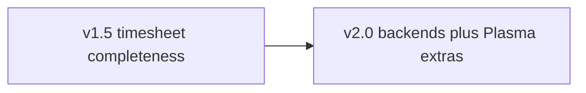

# Plasmai roadmap

Where the widget is going after **1.6.1**. [DESIGN.md](DESIGN.md) is *how* Plasmai should look and behave; this file is *what* is worth building next. [CHANGELOG.md](CHANGELOG.md) stays the history of what already shipped.

Current release: **1.6.1** — 1.6.0 WorkContract remaining hours and already-running notification, without the logind shutdown hold (removed: Kickoff reboot kills plasmashell first). 1.5.0 remains the timesheet-completeness baseline.

---

## What 2.0 means

1.5.0 closed the “Kemai-like timesheet in the panel” gap for Kimai: live timer, recents, favorites, continue, switch-while-running, edit running *and* stopped entries, tags, billable, create entities, stats, sparkline, work-contract remaining (with vacation/holidays), idle keep/discard/continue, forgot-to-start, multi-profile, KWallet.

**2.0 is not more Display checkboxes.** It should mean:

1. **Backends that are no longer experimental** — Clockify, Toggl Track, and/or SolidTime verified with live accounts, same flyout, capabilities still gating missing APIs.
2. **Plasma-native extras that stay a plasmoid** — optional KRunner (separate package), not a tray app. Global shortcuts and D-Bus script control were tried and **removed**; they do not belong in 2.0 unless a later design revisits them.
3. **Provider gaps that 1.5 left explicit** — Clockify name-based tags, SolidTime tags, Toggl `#`/`@` in the description field only if they stay optional beside pickers.

The 2.0 tag is when Kimai remains the reference backend **and** at least one other backend is documented as production-tested.

Stay inside DESIGN.md: panel widget (not a standalone app), QML-only Store package, features gated with `TimeTracker.providerCapabilities`.

---

## Shipped in 1.5.0 (no longer 2.0 work)

### Timesheet completeness

- Tags on Add entry and Edit running (`TagPicker`, Kimai create-new, Toggl when names work). Clockify/SolidTime still hide the field (`tags` capability).
- Billable on Add entry and Edit running; new entries default billable (`billableEdit`).
- Edit, delete, split stopped Recents from a **permanent** overflow icon (`editStopped`, `deleteEntry`).
- Create customer / project / activity from picker overflow (`createEntities`).
- Last-used Start when Recents are empty (shared.json). Continue remains “last recent”.
- Week remaining minus approved absences and public holidays (`holidayBundle` / kimai-holiday-bundle). **1.6.0:** same remaining math with the official WorkContractBundle (`/api/absences`), auto-detected so only one plugin is used.

### Idle and reminders

- Idle dialog: keep time, discard (stop at idle start), discard and continue.
- Wayland idle: session IdleHint / ScreenSaver first; `xprintidle` on X11.
- Forgot-to-start: one notification per local day during work hours, opt-in on Behavior.

### Settings reliability (1.5 polish, not a 2.0 pillar)

- Connection Apply, unique profile names, reusable “Profile N”, token-clear only when a token exists.
- Connection profiles survive KCM tab switches (`shared.json` over `cfg_*` placeholders).
- Favorites loading indicator; catalog JSON off the UI thread; colors from Maintenance cache groups.
- Desktop blur via `StandardBackground`. Profile switcher on main + stats only.

**Tried and dropped in 1.5:** Plasma global shortcuts and script/IPC control. Do not re-add without a new DESIGN.md decision.

**Tried and dropped in 1.6:** logind shutdown/reboot inhibit inside the plasmoid. Kickoff teardown drops the lock; a Kate-like logout prompt needs a session-managed app, not a panel widget.

### Shipped in 1.6.0

- Official WorkContractBundle remaining hours (auto-detect vs kimai-holiday-bundle; absence credit so auto-timesheets are not double-counted).
- One “Tracking in progress” notification if a timer is already running when the widget starts.
- All 12 bundled languages cover the current UI; KDE Store description localized.

---

## Comparison (still true)

Peers are **desktop/panel trackers**, not the full Kimai/Clockify web apps.

### Kemai

- **Have:** start/stop, recents, profiles, idle keep/discard/continue, description, tags, billable, create customer/project/activity, edit/delete/split stopped recents, holiday-aware week remaining.
- **Still missing vs Kemai:** Kimai Task Management plugin; “template” (reload last timesheet without starting).
- **Skip:** a second windowed Kemai.

### Clockify desktop

- **Have:** timer, manual entry, continue, last-used, idle, notifications, billable, edit/delete/split recents.
- **Gap:** tags (API is id-based); offline queue.
- **Skip:** auto-tracker, screenshots, Pomodoro as the product, mini window.

### Toggl Track desktop

- **Have:** timer, description, tags, idle, continue.
- **Gap:** `#` tags and `@` project in the description field (pickers remain the path).
- **Skip:** app timeline; tray-only app.

### SolidTime desktop

- **Have:** timer, projects/clients in the Kimai-shaped UI, billable, stats, idle.
- **Gap:** tags; calendar / week timesheet grid; tasks if the API grows.
- **Skip:** automatic activity tracking.

### Won’t clone

Kimai web invoices/expenses/custom fields; KTimeTracker local database; Hamster “facts.” Plasmai stays an API client in the panel.

---

## Pillars for 2.0

### 1. Backend 2.0 (the actual 2.0 gate)

Clockify, Toggl Track, and SolidTime are implemented against public APIs but still **experimental** until verified with live accounts (DESIGN.md).

- Live-account pass per provider: start/stop, patch running, recents, stats, billable, tags if advertised, create/edit/delete/split.
- Drop “experimental” per backend only after that pass — not all three in one commit if only one is proven.
- Still no forked UI. Missing API surface stays a capability flag (`false`).
- Clockify tags only when the API can take names (or a small id-picker that still looks like `TagPicker`).

### 2. Provider completeness (optional slices, can land as 1.6.x)

- SolidTime tags if the API exposes them.
- Toggl `#` / `@` in description as *shortcuts to pickers*, not a second data model.
- Kimai Task plugin only if the API is stable and gated (`createEntities`-style flag).

### 3. Plasma extras (optional, not blocking 2.0)

- **KRunner** as a *separate* package if ever; the Store QML applet cannot ship binaries.
- Do **not** restore global shortcuts, D-Bus IPC, or a logind shutdown hold unless DESIGN.md is rewritten.

Constraint: panel click still must not start/stop. No standalone tray app.

---

## Later / maybe

Not required to call it 2.0.

- Compact **week timesheet grid** as another `mainViewMode` (SolidTime / Clockify), same density as stats.
- Map **KDE Activities** to a default project (easy to get wrong).
- **Pomodoro** as a Behavior option — not a second product.
- Offline **queue** of start/stop if the API is down. Hard in a plasmoid; do not fake local timesheets.
- “Template” / reload last timesheet without starting (Kemai).
- Desktop-widget blur already follows the containment; theme-specific `blurred` prefixes stay a Plasma theme concern.

---

## Won’t do

- App/window **auto-tracker** and **screenshots**.
- **Invoicing, expenses, team dashboards**.
- A **standalone window** or “minimize to tray” Kemai clone.
- **Compiled binaries** in the Store plasmoid.
- Per-provider color/Maintenance UI. Color distinction stays Kimai-only.
- Global shortcuts / script control as they shipped-and-reverted in 1.5.
- logind shutdown inhibit from the plasmoid as it shipped-and-reverted in 1.6.

---

## How to use this file

Pick work from the 2.0 pillars. Prefer slices that are useful alone (one live backend pass, Clockify tags). When something ships, mention it in the changelog and update this file — do not leave a second source of truth that contradicts DESIGN.md.

If a proposal needs a new visual language, interaction, or `cfg_*` key, update DESIGN.md in the same change.
