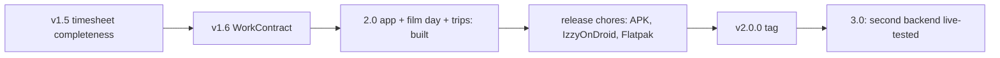

# Plasmai roadmap

Where Plasmai is going. [DESIGN.md](DESIGN.md) is *how* Plasmai should look and behave; this file is *what* is worth building next. [CHANGELOG.md](CHANGELOG.md) stays the history of what already shipped.

Last release: **1.6.2** (tagged). 1.6.3 and the 1.x Kimai 2.67 fixes landed on `main` untagged and are part of 2.0.0.

In progress: **2.0.0** — the version is set everywhere (`metadata.json`, app, store, landing page), but **not tagged**. The tag waits for the release chores (signed APK, IzzyOnDroid, Flatpak), not for a second backend any more.

---

## What 2.0 means

1.5.0 closed the “Kemai-like timesheet in the panel” gap for Kimai: live timer, recents, favorites, continue, switch-while-running, edit running *and* stopped entries, tags, billable, create entities, stats, sparkline, work-contract remaining (with vacation/holidays), idle keep/discard/continue, forgot-to-start, multi-profile, KWallet.

**2.0 is not more Display checkboxes.** It means **the same Plasmai on the phone**: the Kirigami app for Android and Plasma Mobile, with the film day and trips (built, see below). Kimai is the reference backend; Clockify, Toggl Track and SolidTime ship as experimental.

**Decided 2026-09-27:** the second live-tested backend is no longer the 2.0 gate; it moved to **3.0** (see “Pillars for 3.0”). 2.0.0 is tagged once the release chores are done.

Stay inside DESIGN.md: on the desktop a panel widget, QML-only Store package, features gated with `TimeTracker.providerCapabilities`.


```mermaid
flowchart LR
  v15[v1.5 timesheet completeness]
  v16[v1.6 WorkContract]
  app[2.0 app + film day + trips: built]
  chores[release chores: APK, IzzyOnDroid, Flatpak]
  tag[v2.0.0 tag]
  gate[3.0: second backend live-tested]
  v15 --> v16 --> app --> chores --> tag --> gate
```

---

## Built for 2.0.0 (untagged)

### Android / Plasma Mobile app (`app/`)

- Kirigami app sharing the provider layer (`contents/code/*`) and copies of the Plasmoid components (`app/qml/shared/`).
- Timer, continue, switch, edit running, add entry, favorites, recents with edit/split/delete (menu on long press), statistics, settings, 11 languages.
- Optional Kante / Kante Light style from the shared Kante design system, in the app and the Plasmoid.
- Tested on a Pixel 6 (Android) and offscreen with the KDE style (Plasma Mobile); no real Plasma Mobile device yet.
- Desktop builds (Linux tarball, Flatpak manifest) exist for packaging; on the desktop the Plasmoid stays the product.

### Film day view with the Drehzettel plugin (Plasmoid and app)

- `filmDaySync.js`: plugin probe per profile, engagement gating, only changed fields sent. Online only: no copy on the device, no queue.
- All plugin fields: `breakMinutes`, `catering`, `category`, `note`, `dayType`, `productionDay` (1–7), `shootingDayNumber`, `extraPayCents`; earnings from the day summary.
- Merge of several entries per day.
- Three states: before the shoot (the day's engagement, “Start shooting day” with the main timer), running (begin editable, pay so far, stop), done (times and extras save directly). The production's shooting day is counted from the engagement's Kimai entries. The local mode, offline queue, migration and conflict review of the first 2.0 builds were removed again (online only).

### Trips with the Anfahrten plugin (MileageBundle, Plasmoid and app)

- Log, edit, delete trips linked to a timesheet; Dawarich suggestions; km in statistics; `showTrips` setting.
- App: Trips page, “Commute today”, trip offer after a travel day.

### Removed

- Color distinction and the Maintenance settings page (a separate Kimai plugin handles it).

---

## Shipped in 1.5 / 1.6

### Timesheet completeness (1.5.0)

- Tags on Add entry and Edit running (`TagPicker`, Kimai create-new, Toggl). Clockify/SolidTime still hide the field (`tags` capability).
- Billable on Add entry and Edit running (`billableEdit`); since 1.6.3 Kimai resolves the default.
- Edit, delete, split stopped Recents (`editStopped`, `deleteEntry`).
- Create customer / project / activity from picker overflow (`createEntities`).
- Last-used Start when Recents are empty (shared.json).
- Week remaining minus approved absences and public holidays (kimai-holiday-bundle; 1.6.0 also the official WorkContractBundle, auto-detected).

### Idle and reminders (1.5.0)

- Idle dialog: keep time, discard (stop at idle start), discard and continue.
- Wayland idle: session IdleHint / ScreenSaver; `xprintidle` on X11.
- Forgot-to-start: one notification per local day during work hours, opt-in.

### 1.6.x

- 1.6.0: WorkContractBundle remaining hours; “Tracking in progress” notification when a timer already runs at start.
- 1.6.2: Favorite clicks match Recents (switch dialog, already-running hint).
- 1.6.3: new icon; ask before saving a running start inside the previous timesheet.

**Tried and dropped:** Plasma global shortcuts and script/IPC control (1.5); logind shutdown/reboot inhibit (1.6). Do not re-add without a new DESIGN.md decision.

---

## Pillars for 3.0 and later

### 1. Second backend (the 3.0 gate) — open

Clockify, Toggl Track and SolidTime are implemented against public APIs but still **experimental**.

- Live-account pass for at least one provider: start/stop, patch running, recents, stats, billable, tags if advertised, create/edit/delete/split — in the Plasmoid **and** the app.
- Drop “experimental” per backend only after that pass (README, DESIGN.md, landing page, store text).
- No forked UI. Missing API surface stays a capability flag (`false`).

### 2. Provider completeness — open, optional

- Clockify tags (`tags: false`): only when the API can take names, or a small id picker that still looks like `TagPicker`.
- SolidTime tags (`tags: false`) if the API exposes them.
- Toggl `#` / `@` in description as *shortcuts to pickers*, not a second data model.
- Kimai Task plugin only if the API is stable and gated (`createEntities`-style flag).

### 3. Platform parity — open

The app lags the Plasmoid in features from 1.5/1.6:

- ~~Week remaining without absences, no “Tracking in progress”, silent failed writes~~ — done.
- Android has no idle detection; the idle dialog was never seen live on either app platform.

The Plasmoid lags the app:

- ~~No trip offer after a travel day~~ — both offer “Log trip” on a finished travel day.

Both:

- ~~Component copies drift~~ — one source since pillar 5.
- ~~Plugin views not checked rendered~~ — film day and trips are rendered and used in the Plasmoid, the app offscreen and on a Pixel 6.

### 4. Plasma extras — optional, not blocking

- **KRunner** as a *separate* package if ever; the Store QML applet cannot ship binaries.
- Do **not** restore global shortcuts, D-Bus IPC or a logind shutdown hold unless DESIGN.md is rewritten.

Constraint: panel click still must not start/stop. No tray app on Linux (Windows: pillar 7).

### 5. Cross-platform foundation — done

Stay on Kirigami, but make the code portable: one source for components and logic, platform code behind one interface. Offline mode (6) and the Windows client (7) build on it; each item below is useful alone.

```
 today                                    target
 contents/ui/main.qml (3900 lines) ─┐     contents/code/*.js controllers (timer, idle, totals, film day)
 app/qml/main.qml     (900 lines) ──┘ ──►   ▲ bind only
 contents/ui/*.qml ◄─copy─► app/qml/shared  contents/ui/*.qml, one copy, controls via Controls/
 app/main.cpp (#ifdef, D-Bus inline)        platform_{linux,android,windows}.cpp behind one interface
```

1. ~~**Logic out of `main.qml`**~~ — done: the rules both clients had in their own `main.qml` live in `contents/code/`, with tests: `workTotals.js` (today/week totals, targets, absence credit), `timerSession.js` (idle prompt, keep/discard, forgot-to-start, running-entry state, when a refresh may replace a typed description, the stop-then-start switch), `favorites.js` in the app too (one pin format: the app wrote `,`, the Plasmoid `;`, so each dropped the other's pins). What stays per client is binding and UI: dialogs, messages, notifications, which refresh follows. Found on the way: the app lost typed descriptions on every refresh, the Plasmoid's "continue last" ignored a switch.
2. ~~**One component source**~~ — done: all shared components live in `contents/ui/` only; `app/qml/shared/` keeps a qmldir pointing there (and the app-only `WrapCheckBox`). Controls that differ per platform sit in `contents/ui/Controls/`: Plasma wrappers in the Plasmoid, while the app's qrc puts `app/qml/controls/` at that path (Label, ToolTip, CheckBox, Button, ToolButton, Heading, SegmentButton, DatePicker, TimePicker, FormDialog). The app's Kante lives at `contents/ui/Kante` (one KanteStyle singleton). `DaySparkline` uses `MultiEffect` instead of Qt5Compat. CI compiles every shared component against libplasma (`tst_controls.qml`); screenshots of both clients in both styles, before and after, guard the look.
3. ~~**Platform services, one file per platform**~~ — done: `app/platform/` (TokenStore, FileStore, UserAgentNam, AndroidBackFilter; IdleWatcher and Notifier with `*_dbus.cpp` / `*_none.cpp` picked in CMake, offered to QML only where supported; NetworkStatus from `QNetworkInformation`: the app refreshes as soon as the network is back). Autostart and outbox storage come with their first user, the tray client (7, stage 2) and the outbox (6, stage B): alone they would be unused code.
4. ~~**JSON i18n in the app everywhere**~~ — done: no KI18n/KCoreAddons in the app. The catalogs now carry all plural forms and the language's rule (`app/i18nfallback.cpp`, C++ tests); this fixed wrong plurals on Android in ru, uk, pl, ja, zh_CN and fr.
5. ~~**One timestamp parser**~~ — done: `DTF.parseStamp` / `DTF.stampMs` in `dateTimeFormat.js` parse every server stamp and form input (JS libraries, providers, Plasmoid and app QML). Qt 6.4 already parsed Kimai's formats; the gain is one place instead of six variants, and a date alone as local midnight. Film day tests no longer assume Berlin time.
6. ~~**CI as the guard**~~ — done: `.github/workflows/checks.yml` — unit tests in an Arch container (Kirigami, libplasma) in three time zones, `qmllint` on `contents/ui` (without the "unqualified" and "missing-property" noise), app resources, the app built on Linux, Windows (Qt 6.10) and macOS with its C++ tests, the token storage against a real keychain on all three. Not linted: the app's own pages (they resolve only through the qrc; needs `qt_add_qml_module`).


### 6. Offline mode — done

Bad reception on set: Plasmai keeps working and syncs as soon as the server answers again. `contents/code/offline.js` (tests: `tst_offline.qml`), described in DESIGN.md "Offline". Built as planned below, with these decisions:

- The layer wraps the tracker (pages keep their calls); reads answer from the snapshot on a network error, not only at start. Trips go through it too.
- A create whose first try may have reached the server looks for that entry before it is sent again (a lost answer must not duplicate it).
- Conflicts are checked for entries (read before patch/delete). Trips have no conflict check (the plugin has no single-trip read): last writer wins.
- The Plasmoid's files carry the widget id: two widgets in one plasmashell keep their own outboxes.
- Not done: Android background sync (WorkManager), still a separate project.

The plan as written before:

Scope: **app and Plasmoid**, Kimai only. The layer sits in the shared code (`contents/code/`), so both get it; storage goes through `platform.js` like the catalog cache already does (`saveCatalog`: `catalogCache.sh` on the desktop, `FileStore` in the app).

```
 UI ──► kimaiApi.js write ──► online? ──yes──► server
                                 │no
                                 ▼
             offline-capable? ──no──► “needs a connection”, nothing queued
                                 │yes
                                 ▼
                 outbox (platform.js, on disk) ──► replay on: next good request,
                                                   network change, start/resume
```

**Offline-capable vs. online only**

| Offline (queued) | Online only (disabled offline, with a hint) |
|---|---|
| Timer start / stop | Split an entry |
| Add entry | Film day “merge entries” (deletes entries) |
| Film day save (entry + extras) | Create customer / project / activity |
| Edit begin/end/description of a stopped entry | Idle “discard” / “keep and split” |
| Delete an entry | Switch profile / connection settings |
| Trips (create / edit / delete) | Statistics beyond the cached range |

Rule: queue only ops that touch one entry and need no server answer to continue. Anything creating ids others depend on (master data) or turning one entry into several stays online only.

**Stage A — read offline (3–5 days)**

- Persist the last known state per profile: recents, active timer, engagements, the film day cache (`filmDaySync.js` `memo.days`, today memory only); the catalog is already on disk.
- Offline = network error or timeout (not 401/403/4xx). App: banner “Offline — state of HH:MM”. Plasmoid: the existing `connectionState` shows it; no toast per poll.
- Writes disabled; useful alone, the base for stage B.

**Stage B — outbox for timer, add entry, film day (2–3 weeks)**

- **Outbox** per client and profile, an ordered list `{ localId, op, fields, createdAt, attempts, lastError }`, stored via `platform.js` (new `loadOutbox`/`saveOutbox` in `desktopBackend.js` and `appBackend.js`). Not shared between app and Plasmoid: two writers on one file is the `shared.json` problem again; the conflict check below covers the other client.
- One layer in `kimaiApi.js`/tracker: pages keep their calls; online-only ops check `isOffline()` and disable their action.
- **Start offline** → `createTimesheet` with explicit `begin` (the server would set its own time); **stop** → `patchTimesheet` with `end`. The running entry lives locally until synced.
- **Local ids**: an entry made offline gets `local:<uuid>`; later ops on it (stop, extras) are rewritten to the server id once the create succeeds.
- **Film day**: the PUT needs an engagement; offline it relies on the cached engagements. Own op after the timesheet op, as `saveDay` does online.
- **Replay** strictly in order, stop at the first failure. Network error → retry later. Validation error (overlap, lockdown, 400/409) → the op stays with its error in an “Unsynced” list: edit, retry or discard. Never dropped silently.
- **Conflicts**: Kimai has no versions/ETags. Before replaying a patch on an existing entry, read it; changed since it was loaded (web, the other client) → ask, do not overwrite.
- **Triggers**: every successful request; app: `QNetworkInformation` reachability (`app/main.cpp`), start and resume; Plasmoid: the existing poll timer. No Android background sync (WorkManager) — a separate project.
- UI in both: pending count, entries marked “not synced”, stats/week totals include pending entries.
- Tests: outbox order, id rewrite, replay stop on failure, conflict check, online-only ops refused (fake XHR, as `tst_filmDaySync.qml`).

**Stage C — the other offline-capable ops (+1–2 weeks)**

Edit and delete of stopped entries, trips (`createTrip`/`patchTrip`/`deleteTrip`, a trip linked to a `local:` timesheet waits for its id). The online-only column stays online only.

**Plasmoid extra (+~1 week over app only)**: shell-script storage for the outbox, the compact panel UI (pending badge, “Unsynced” list in the full view), manual testing on plasmashell.

**Risks**

- Late errors: Kimai rules (overlap, lockdown, min/max duration) fire at sync time, hours later.
- App and Plasmoid each queue: the Plasmoid may stop a timer the app started offline → conflict on replay, resolved by the read-before-patch check.
- Clock skew between device and server for offline begin/end.

### 7. Windows tray client — planned

A native Windows client: **tray icon + popup only**, conceptually the Plasmoid (icon shows the timer state, click opens the popup, nothing else on screen). Linux keeps the Plasmoid; this is Windows only. Reverses “no tray app” (pillar 4, “Won’t do”, DESIGN.md “Product intent”) for Windows — update both files in the same change.

**Approach: the Kirigami app in a tray shell**, not a rewrite.

| Option | Reuse | Verdict |
|---|---|---|
| Kirigami app (`app/`) + C++ tray shell | provider layer, app state (`app/qml/main.qml`), pages, i18n JSON, QtKeychain | **chosen** |
| Port the Plasmoid (`contents/ui/main.qml`) | — needs Plasma imports (`org.kde.plasma.*`, P5Support) | no |
| WinUI / C# rewrite | nothing | no |

```
 QSystemTrayIcon ──left click──► TrayPopup (frameless QQuickWindow, Kirigami pageStack)
   │ icon: idle / running (red dot, as Kante)      │ timer, recents, favorites, film day, trips
   │ tooltip: project · activity · 1:23            │ closes on focus loss, like a Plasma popup
   └─right click──► menu: stop · continue last · open Kimai · settings · autostart · quit
                                                   settings / connection: normal window
```

**Stages**

1. **Windows build (3–5 days)** — `app/` with MSVC and Qt 6 on a GitHub Windows runner; Kirigami from KDE Craft (or built from source: only Qt + ECM); QtKeychain → Windows Credential Manager; no KI18n (the JSON catalogs of `I18nFallback` already cover Android). Goal: today's app window runs on Windows. Main risk of the plan.
2. **Tray shell (1–1.5 weeks)** — C++ `TrayController`: `QSystemTrayIcon`, popup placed next to the icon (`QSystemTrayIcon::geometry()`, taskbar edge), hide on focus loss, single instance (`QLocalServer`: a second start opens the popup), autostart (HKCU `Run` key). QML `TrayPopup` hosting the existing pages at popup size; the icon and tooltip follow `activeTimesheet`.
3. **Platform services (3–5 days)** — idle via `GetLastInputInfo` (idle dialog as on the Plasmoid), notifications via `QSystemTrayIcon::showMessage` (Windows toasts later if needed), light/dark from Windows (`QStyleHints::colorScheme`), per-monitor DPI.
4. **Packaging (1 week)** — `windeployqt` + installer (Inno Setup or MSIX), portable zip, code signing (SignPath for OSS), winget manifest, a job in `release.yml`.
5. **Parity pass (3–5 days)** — every Plasmoid feature in the popup (film day, trips, stats, idle, forgot-to-start), Kimai live-tested on Windows 10 and 11.

**Total: ~4–6 weeks**, less after pillar 5 (one component source, platform services per file, JSON i18n: stages 1 and 3 shrink). The offline layer (pillar 6) comes along once it is in the shared code; the Windows backend implements its `platform.js` storage via `FileStore` (AppData).

**Rules**

- Popup behaves like the Plasmoid: tray click opens, never starts/stops; no main window, no taskbar button.
- No Windows-only features; missing platform services stay capability flags.
- Same QML as the app (`app/qml/`), no third copy of the components.

**Risks**

- Kirigami on Windows is less used than on Linux/Android: styling and popup focus behavior need testing.
- Tray popup placement varies (taskbar top/left, overflow area “^”, several monitors).
- Unsigned builds trigger SmartScreen; signing is needed for real users.

### Release chores for 2.0.0 (see RELEASE-TODO.md)

Keystore, CI run on GitHub, signed APK, Flatpak build, aarch64 tarball, app ID and versionCode decisions, store listing.

---

## Known limits

- Times use the device time zone, not the Kimai profile time zone (QML JS has no IANA zones).
- Night shoots (end after midnight) cannot be entered in the film day view.
- KCM settings pages have no 30 s request watchdog.
- Absence credit cannot yet tell WorkContract auto-bookings apart reliably.

---

## Comparison (still true)

Peers are **desktop/panel trackers**, not the full Kimai/Clockify web apps.

### Kemai

- **Have:** start/stop, recents, profiles, idle keep/discard/continue, description, tags, billable, create customer/project/activity, edit/delete/split stopped recents, holiday-aware week remaining.
- **Still missing vs Kemai:** Kimai Task Management plugin; “template” (reload last timesheet without starting).
- **Skip:** a second windowed Kemai.

### Clockify desktop

- **Have:** timer, manual entry, continue, last-used, idle, notifications, billable, edit/delete/split recents.
- **Gap:** tags (API is id-based); offline queue (planned, pillar 6).
- **Skip:** auto-tracker, screenshots, Pomodoro as the product, mini window.

### Toggl Track desktop

- **Have:** timer, description, tags, idle, continue.
- **Gap:** `#` tags and `@` project in the description field (pickers remain the path).
- **Skip:** app timeline; tray-only app.

### SolidTime desktop

- **Have:** timer, projects/clients in the Kimai-shaped UI, billable, stats, idle.
- **Gap:** tags; calendar / week timesheet grid; tasks if the API grows.
- **Skip:** automatic activity tracking.

### Won’t clone

Kimai web invoices/expenses/custom fields; KTimeTracker local database; Hamster “facts.” Plasmai stays an API client.

---

## Later / maybe

Not required for 2.0.

- Compact **week timesheet grid** as another `mainViewMode` (SolidTime / Clockify), same density as stats.
- Map **KDE Activities** to a default project (easy to get wrong).
- **Pomodoro** as a Behavior option — not a second product.
- Offline queue — planned, see pillar 6.
- “Template” / reload last timesheet without starting (Kemai).
- Anfahrten: tax report (`/tax`), receipts.
- Desktop-widget blur already follows the containment; theme-specific `blurred` prefixes stay a Plasma theme concern.

---

## Won’t do

- App/window **auto-tracker** and **screenshots**.
- **Invoicing, expenses, team dashboards**.
- A desktop **standalone window** or “minimize to tray” Kemai clone. The Kirigami app exists for phones; on the Linux desktop the Plasmoid is the product (Windows gets a tray-only client, pillar 7).
- **Compiled binaries** in the Store plasmoid.
- Per-provider color UI.
- Color distinction / clash maintenance inside Plasmai. A separate Kimai plugin handles that.
- Global shortcuts / script control as they shipped-and-reverted in 1.5.
- logind shutdown inhibit from the plasmoid as it shipped-and-reverted in 1.6.

---

## How to use this file

Pick work from the 2.0 pillars; pillar 1 unblocks the tag. Prefer slices that are useful alone (one live backend pass, Clockify tags, one parity gap). When something ships, mention it in the changelog and update this file — do not leave a second source of truth that contradicts DESIGN.md.

If a proposal needs a new visual language, interaction, or `cfg_*` key, update DESIGN.md in the same change.
